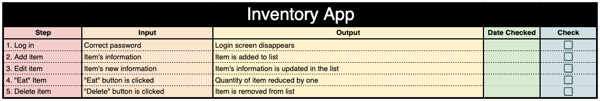
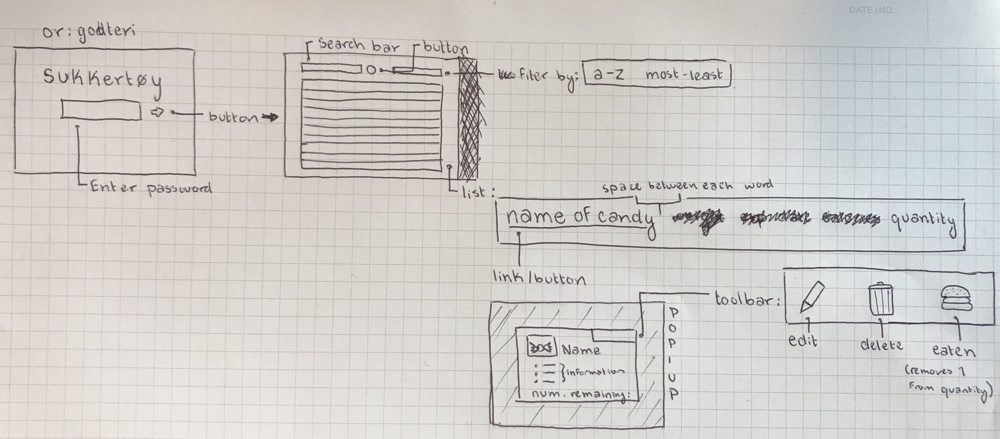
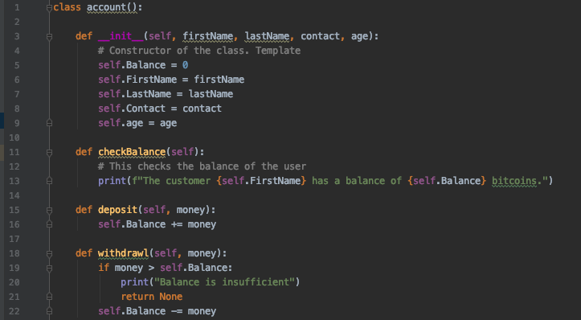

# Unit 3: Web-Based Application

Contents
----
  1. [Planning](#planning)
  2. [Solution Overview](#overview)
  3. [Development](#development)
  4. [Evaluation](#evaluation)
  5. [Bibliography](#bibliography)
  
  
Planning
---

### Definition of the Problem
My client is Alex Nygaard. He is an international high school student in Japan, who has brought food from his home in Norway. However, he brought so much that he loses track of how much food he has and what he has eaten. He asked me in an email (see ref. 1.1.a) to help him develop a secure system for him to keep track of this food by organizing it and giving him the ability to input when something has been eaten.

### Rationale for Proposed Solution
I am making an inventory web application for Mr. Nygaard. It will allow him to organize his snacks, search for his snacks, and register his snacks as eaten. I will use the python language to write the code, and QT designer to design the visual layout of the application. These are both very easy to use, and will make the process run smoothly. This will make for a very simple application that lets Mr. Nygaard complete his desired tasks without needing to naviage a complicated application. Mr. Nygaard approved this solution, as seen in appendix ref. 1.1.b.

### Success Criteria
1. There is a password login system
2. A candy/drink can be added
3. Candies and drinks are organized by:
    * Name of the brand
    * Weight
    * Calories per 100g
    * Taste
    * Quantity (number of packages)
4. An item can be edited
5. An item can by deleted

This success criteria was approved by Mr. Nygaard with no changes, see appendix ref. 1.1.c

Overview
---

### System Diagram

*Figure x* - This shows the system diagram and archetecture of the web application.

### Test Plan

*Figre x* - This shows the test plan for the application. An updated version of this can be found in [Evaluation](#evaluation)

### Design Sketch

*Figure x* - This is my initial design sketch for the inventory app. It shows the login screen and the main screen, as well as a popup box that would give more information about the candy and would allow for edits to be made.

### UI Design
These screenshots show the final UI that I developped.

*Figure x* - This shows the UI for the login page.

*Figure x* - This shows the UI I created for the main inventory. It changed from the first phase, after realizing that the pop-ups would make the application less efficient.

Development
---

### Skills developped:
* Object Oriented Programming
* Designing UI in QtDesigner
* Converting UI files to python programs
* Button linking
* Hashing passwords
* Adding elements to a table

### Object Oriented Programming (OOP)
The following image shows the basic layout of an OOP program:

*Figure x* - This image shows the layout of an OOP program. OOP splits a code up into classes that have properties (variables) and methods (functinons). Multiple objects can be assigned to a class, allowing for DRY code. The four basics of OOP are encapsulation, abstraction, inheritance, and polymorphism. ([1](#bibliography))

### Designing UI in QtDesigner
QtDesigner is a very useful tool for designing UI. It allows you to design pop-up windows and main window. There are many tools within the application. An example is the 

### Converting UI Files
To use UI files in a program, they must first be converted to code. This is done with the pyQt5 package, which can be installed from pip3.

Once this is installed, the conversion is very easy: `pyuic5 filename.ui -o filename.py`

I also learned that it is important to make edits to the UI file itself, and not in the code, as that is not saved. Once an edit is made, simply re-convert the UI to update the code.

### Button Linking
Buttons are key parts of most UIs. In order for them to work, there is a simple command that links a button to a program: `self.buttonName.clicked.connect(self.programName)`

Evaluation
--

Bibliography
--
1. https://www.youtube.com/watch?v=xoL6WvCARJY
