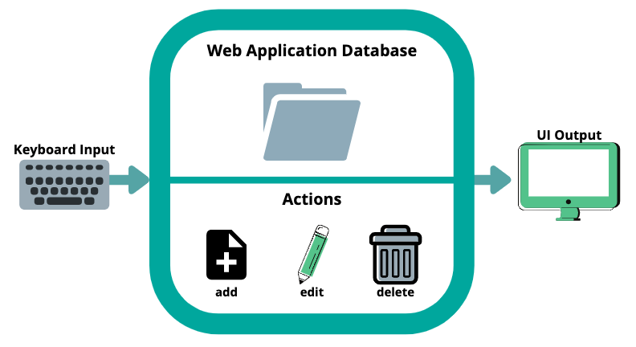
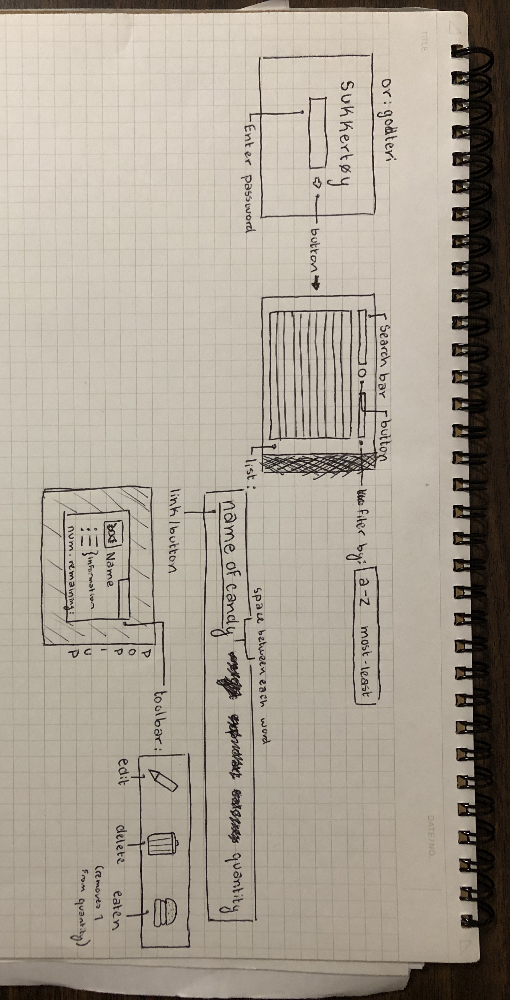
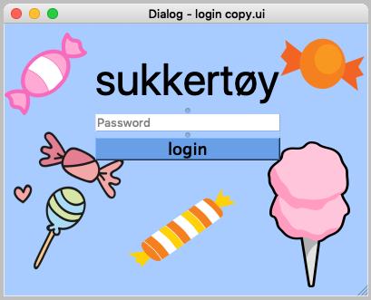

# Unit 3: Web-Based Application

Contents
----
  1. [Planning](#planning)
  2. [Solution Overview](#overview)
  3. [Development](#development)
  4. [Evaluation](#evaluation)
  
  
Planning
---

### Definition of the Problem
My client is Alex Nygaard. He is an international high school student in Japan, who has brought food from his home in Norway. However, he brought so much that he loses track of how much food he has and what he has eaten. He asked me in an email (see ref. 1.1.a) to help him develop a secure system for him to keep track of this food by organizing it and giving him the ability to input when something has been eaten.

### Rationale for Proposed Solution
I am making an inventory web application for Mr. Nygaard. It will allow him to organize his snacks, search for his snacks, and register his snacks as eaten. I will use the python language to write the code, and QT designer to design the visual layout of the application. These are both very easy to use, and will make the process run smoothly. This will make for a very simple application that lets Mr. Nygaard complete his desired tasks without needing to naviage a complicated application. Mr. Nygaard approved this solution, as seen in appendix ref. 1.1.b.

### Success Criteria
1. There is a password login system
2. A candy/drink can be added
3. Candies and drinks are organized by:
    * Name of the brand
    * Weight
    * Calories per 100g
    * Taste category
      * Sweet
      * Sour
      * Salt
    * Quantity (number of packages)
4. An item can be registered as "eaten"
5. An item can be edited
6. An item can by deleted
7. An item can be searched for

This success criteria was approved by Mr. Nygaard with no changes, see appendix ref. 1.1.c

Overview
---

### System Diagram

*Figure x* - This shows the system diagram and archetecture of the web application.

### Design Sketch

*Figure x* - This is my initial design sketch for the inventory app. It shows the login screen and the main screen, as well as a popup box that would give more information about the candy and would allow for edits to be made.

### UI Design
These screenshots show the final UI that I developped.

*Figure x* - This shows the UI for the login page.

*Figure x* - This shows the UI I created for the main inventory. It changed from the first phase, after realizing that the pop-ups would make the application less efficient.

Development
---

Evaluation
--

