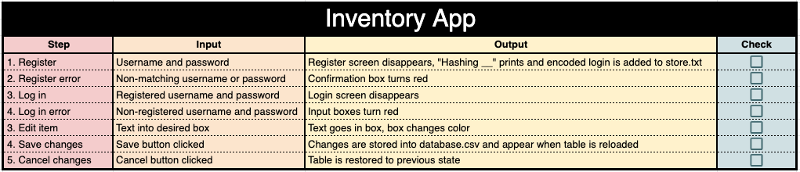
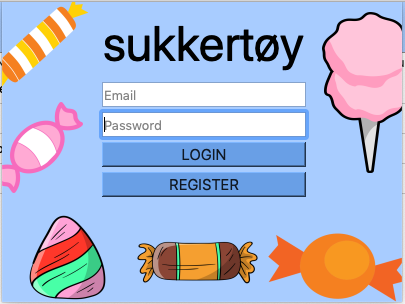
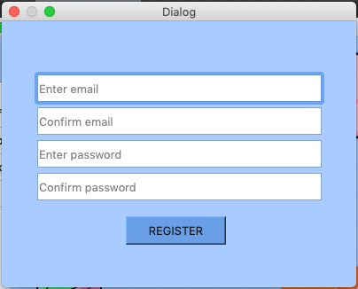
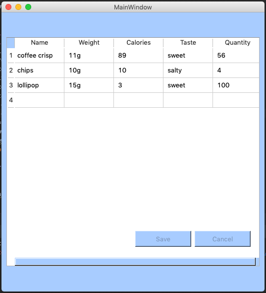

# Unit 3: Web-Based Application

Contents
----
  1. [Planning](#planning)
  2. [Solution Overview](#overview)
  3. [Development](#development)
  4. [Evaluation](#evaluation)
  5. [Bibliography](#bibliography)
  
  
Planning
---

### Definition of the Problem
My client is Alex Nygaard. He is an international high school student in Japan, who has brought food from his home in Norway. However, he brought so much that he loses track of how much food he has and what he has eaten. He asked me in an email (see ref. 1.1.a) to help him develop a secure system for him to keep track of this food by organizing it and giving him the ability to input when something has been eaten.

### Rationale for Proposed Solution
I am making an inventory web application for Mr. Nygaard. It will allow him to organize his snacks, search for his snacks, and register his snacks as eaten. I will use the python language to write the code, and QT designer to design the visual layout of the application. These are both very easy to use, and will make the process run smoothly. This will make for a very simple application that lets Mr. Nygaard complete his desired tasks without needing to naviage a complicated application. Mr. Nygaard approved this solution, as seen in appendix ref. 1.1.b.

### Success Criteria
1. There is a password login system
2. A candy/drink can be added
3. Candies and drinks are organized by:
    * Name of the brand
    * Weight
    * Calories per 100g
    * Taste
    * Quantity (number of packages)
4. An item can be edited
5. An item can by deleted

This success criteria was approved by Mr. Nygaard with no changes, see appendix ref. 1.1.c


Overview
---

### System Diagram


*Figure x* - This shows the system diagram and archetecture of the web application.

### Test Plan


*Figre x* - This shows the test plan for the application. An updated version of this can be found in [Evaluation](#evaluation)

### Design Sketch

*Figure x* - This is my initial design sketch for the inventory app. It shows the login screen and the main screen, as well as a popup box that would give more information about the candy and would allow for edits to be made.

### UI Design
These screenshots show the final UI that I developped.



*Figure x* - This shows the UI for the login page.



*Figure x* - This shows the UI for the register window.



*Figure x* - This shows the UI I created for the main inventory, which changed a lot from the initial planning stages.

### Flow Charts
Below are the flowcharts for the register, login, and load data functions of the application.


*Figure x* - This shows the flowchart for the register class.


*Figure x* - This shows the flowchart for the login window. It is important to note that this did not work in the final application, due to an error called to the verify_password method.


*Figure x* - This shows the flowchart for the load data method, which takes data from database.csv and puts it into the table widget of the UI.


Development
---

### Skills developped:
* Object Oriented Programming
* Converting UI files to python programs
* Button linking
* Hashing passwords
* Adding elements to a table

### Object Oriented Programming (OOP)
The following image shows the basic layout of an OOP program:


*Figure x* - This image shows the layout of an OOP program. OOP splits a code up into classes that have properties (variables) and methods (functinons). Multiple objects can be assigned to a class, allowing for DRY code. The four basics of OOP are encapsulation, abstraction, inheritance, and polymorphism. ([1](#bibliography))

### Converting UI Files
To use UI files in a program, they must first be converted to code. This is done with the pyQt5 package, which can be installed from pip3.

Once this is installed, the conversion is very easy: `pyuic5 filename.ui -o filename.py`

I also learned that it is important to make edits to the UI file itself, and not in the code, as that is not saved. Once an edit is made, simply re-convert the UI to update the code.

### Button Linking
Buttons are key parts of most UIs. In order for them to work, there is a simple command that links a button to a program: `self.buttonName.clicked.connect(self.programName)`

### Hashing Passwords
Hashing passwords is a way of storing encrypted passwords securely so that others can't find the original password. For this project, we used Allesandro Molina's hashing passwords code [2], found below:

```.py
import hashlib, binascii, os

def hash_password(password):
    """Hash a password for storing."""
    salt = hashlib.sha256(os.urandom(60)).hexdigest().encode('ascii')
    pwdhash = hashlib.pbkdf2_hmac('sha512', password.encode('utf-8'),
                                  salt, 100000)

    pwdhash = binascii.hexlify(pwdhash)
    return (salt + pwdhash).decode('ascii')


def verify_password(stored_password, provided_password):
    """Verify a stored password against one provided by user"""
    salt = stored_password[:64]
    stored_password = stored_password[64:]
    pwdhash = hashlib.pbkdf2_hmac('sha512',
                                  provided_password.encode('utf-8'),
                                  salt.encode('ascii'), 
                                  #Note: an error was called to the line above in the excecution of the code#
                                  100000)
    pwdhash = binascii.hexlify(pwdhash).decode('ascii')
    return pwdhash == stored_password
```

### Adding elements to a table
As this is an inventory app, it was very important to be able to load elements into the UI table. For QtDesigner tables, this is done with the following line of code: `self.tableWidget.setItem(row, col, item)`

### Adding elements to a .csv file
The text of the inventory table is stored in a .csv file. In order to change the elements in the file, we did the following:
1. Converted the .csv file into a list
2. Changed the elements of the list according to the user's edits
3. Re-made the .csv file with the updated list using the following code:
```.py
with open("database.csv", "w") as db:
  file = csv.writer(db, delimiter=',')
  file.writerow(newRow)
```

Evaluation
--


Bibliography
--
1. Studytonight. (2018, January 6). What is Object Oriented Programming (OOPS)? Simple Explanation for Beginners [Video file]. Retrieved from https://www.youtube.com/watch?v=xoL6WvCARJY
2. Molina, Alessandro. “Hashing Passwords in Python.” Useful Code, 20 Sept. 2018, www.vitoshacademy.com/hashing-passwords-in-python/.
